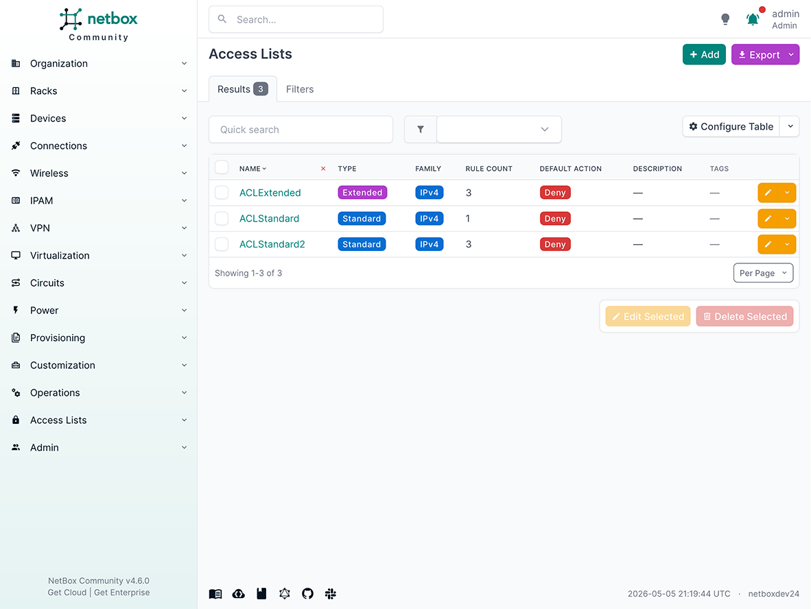
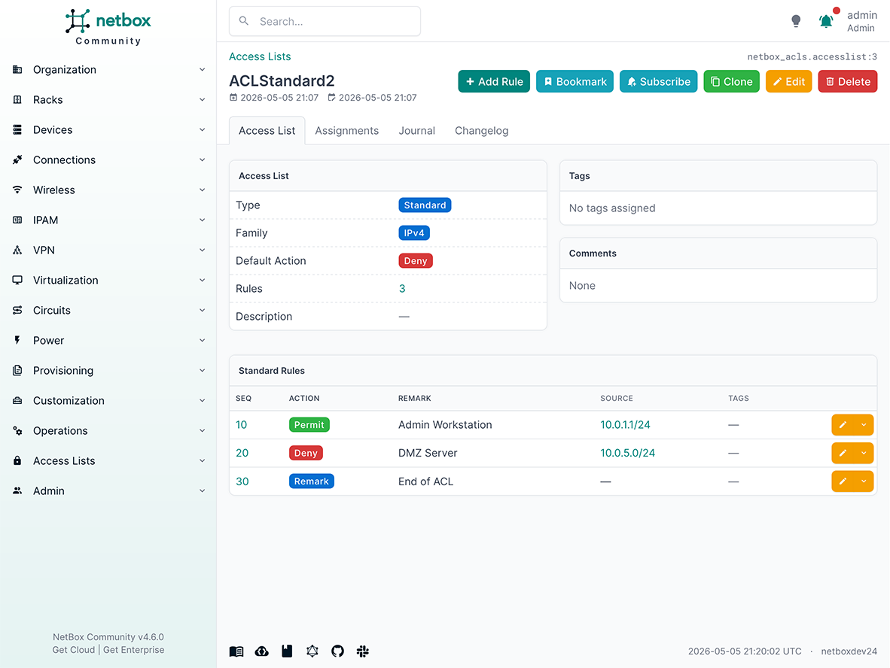
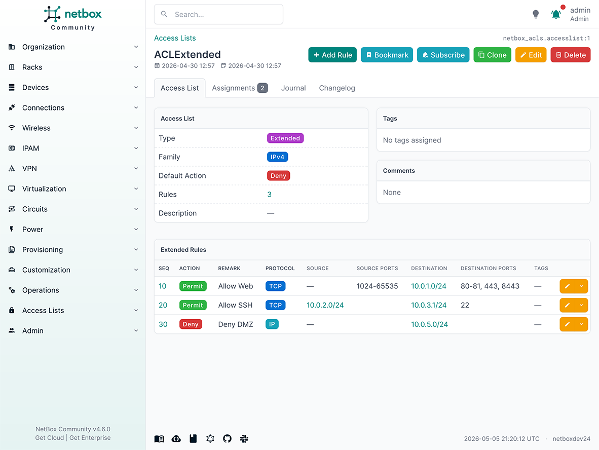
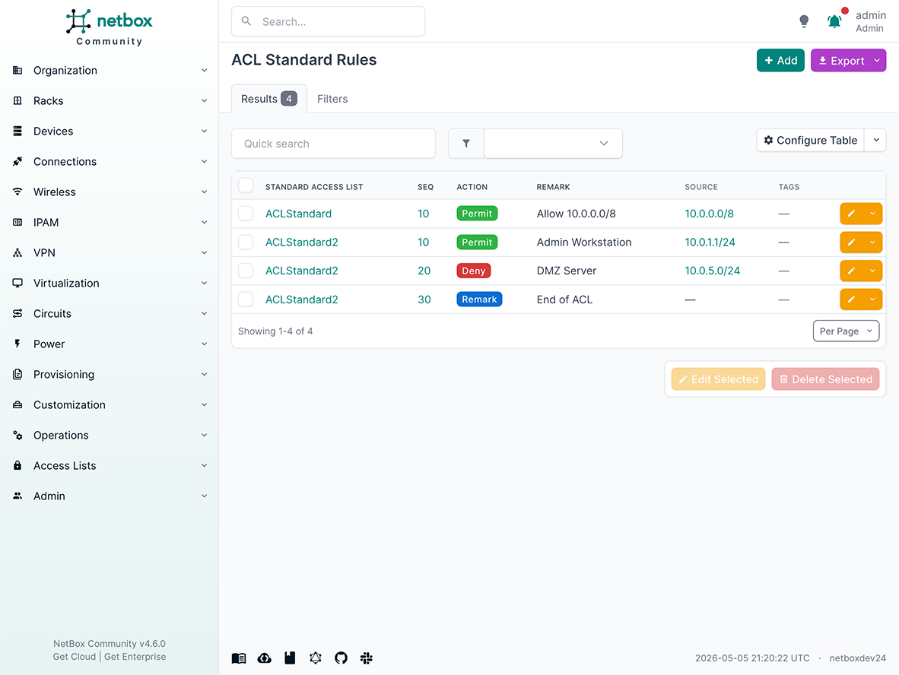
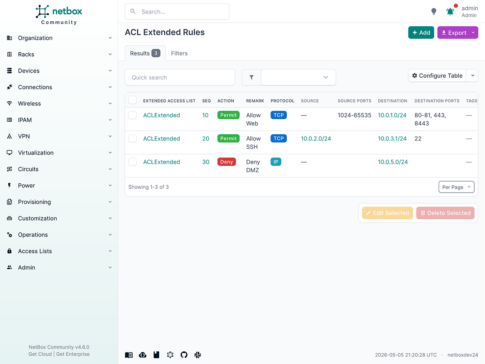
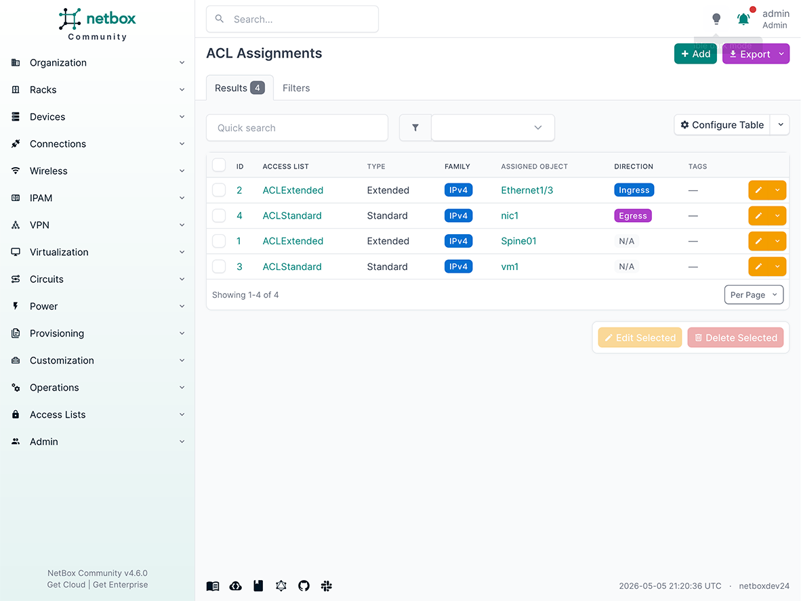
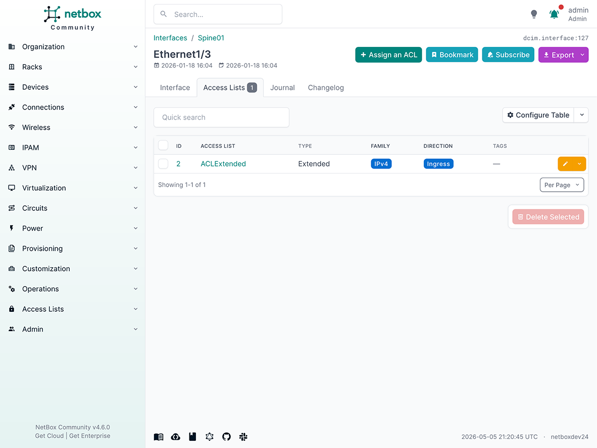

# NetBox Access Lists Plugin

A [NetBox](https://github.com/netbox-community/netbox) plugin for managing
Access Lists.

## Features

- **Access Lists** (Standard and Extended)
- **Standard Rules** for Access Lists
- **Extended Rules** for Access Lists
- **Interface Assignment** for Access Lists

## Compatibility

The following table details the tested plugin versions for each NetBox version:

|   NetBox Version    | Plugin Version |
|:-------------------:|:--------------:|
|        4.6.x        |     2.0.2      |
|        4.5.x        |     2.0.2      |
|        4.4.x        |     1.9.1      |
|        4.3.x        |     1.9.1      |
|        4.2.x        |     1.8.1      |
|        4.1.x        |     1.7.0      |
|  >= 4.0.2 < 4.1.0   |     1.6.1      |
|        3.7.x        |     1.5.0      |
|        3.6.x        |     1.4.0      |
|        3.5.x        |     1.3.0      |
|        3.4.x        |     1.2.2      |
|        3.3.x        |     1.1.0      |
|        3.2.x        |     1.0.1      |

## Installing

### For Docker Setups

For instructions specific to NetBox Docker setups,
see the [netbox-docker plugin documentation](https://github.com/netbox-community/netbox-docker/wiki/Using-Netbox-Plugins).

### Via pip

Activate your NetBox Python virtual environment and run:

```bash
source /opt/netbox/venv/bin/activate

pip install netbox-acls
```

**Important:** When using NetBox's `upgrade.sh`, the virtual environment is
deleted and recreated.
To ensure that the ACL plugin is reinstalled during an upgrade,
add it to your `local_requirements.txt` (for local installations) or
`plugin_requirements.txt` (for container-based installations).

```txt
netbox-acls
```

## Configuration

Enable the plugin by editing the NetBox configuration file.
For local installations, update `/opt/netbox/netbox/netbox/configuration.py`;
for Docker setups, modify `/configuration/plugins.py`:

```python
PLUGINS = [
    "netbox_acls"
]

PLUGINS_CONFIG = {
    "netbox_acls": {
        # Set to True to add a top-level menu item, or False to place it
        # under the Plugins menu. Default is True.
        "top_level_menu": True,
        # Sequence number increment for new ACL rules (e.g., 10, 20, 30...)
        "rule_sequence_step": 10,
    },
}
```

After configuration, apply the changes by running the database migrations:

```bash
source /opt/netbox/venv/bin/activate
cd /opt/netbox
python3 netbox/manage.py migrate
```

## Screenshots

- **Access List** (List View)

  

- **Access List (Standard)** (Detail View)

  

- **Access List (Extended)** (Detail View)

  

- **Standard Access List Rules** (List View)

  

- **Extended Access List Rules** (List View)

  

- **ACL Assignments** (List View)

  

- **Host Access Lists** (New Card for Devices, Virtual Chassis, Virtual Machines)

  

## Developing

### VSCode + Docker + Dev Containers

You can use the provided `.devcontainer` configuration
to set up a development environment with a fully functional NetBox
installation.
This configuration works best with WSL 2.
For this to work, make sure you have Docker Desktop installed and the WSL 2
integrations activated.

1. Open a WSL terminal and run `code` to launch Visual Studio Code.
2. Install the **ms-vscode-remote.remote-containers** extension.
3. Press `Ctrl+Shift+P` and select
   **Dev Container: Clone Repository in Container Volume** to start cloning the
   repository. The process may take some time.
4. (Optional) To prepopulate NetBox with example data from
   [netbox-initializers](https://github.com/tobiasge/netbox-initializers),
   run: `make initializers`
5. Start the NetBox instance: `make all`

After these steps, NetBox will be available at [http://localhost:8000](http://localhost:8000).

## Contributing

This project is maintained by the [netbox-community](https://github.com/netbox-community).
For contribution guidelines, please see the [CONTRIBUTING](CONTRIBUTING.md)
document.

## Credits

This plugin is based on the NetBox plugin tutorial by [jeremystretch](https://github.com/jeremystretch):

- [Demo Repository](https://github.com/netbox-community/netbox-plugin-demo)
- [Tutorial](https://github.com/netbox-community/netbox-plugin-tutorial)

All credit should go to Jeremy. Thanks, Jeremy!

This project aims to build upon the framework and model presented there.
