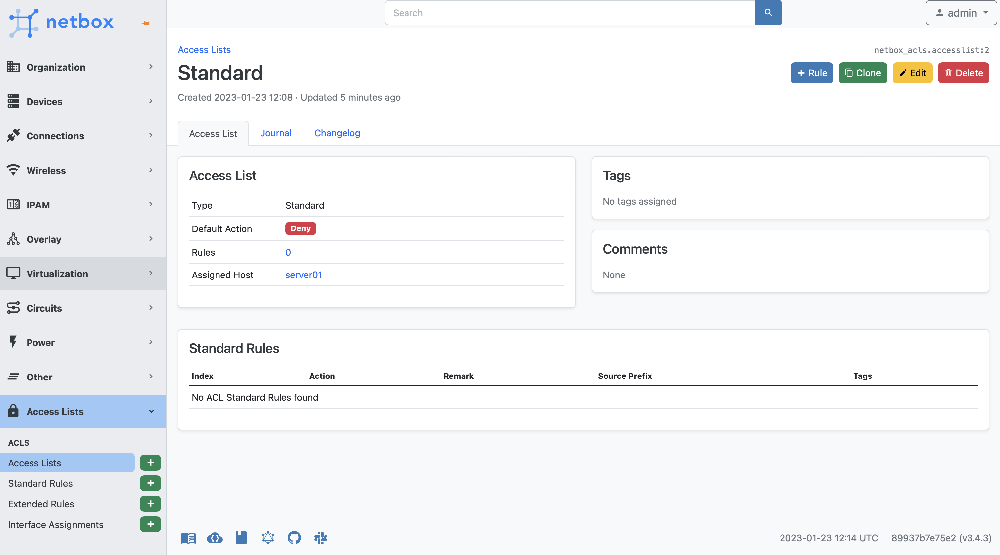
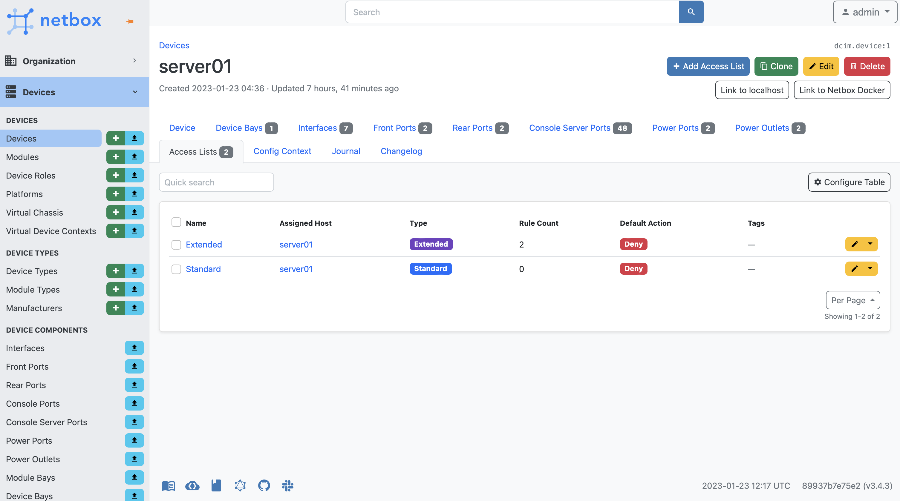

# NetBox Access Lists Plugin

A [Netbox](https://github.com/netbox-community/netbox) plugin for Access List management.

## Features

This plugin provides the following models:

- Access Lists
- Access List to Interface Assignment
- Access List Rules (abstract model bassis for other rules)
- Access List Standard Rules
- Access List Extended Rules

## Origin

Based on the NetBox plugin tutorial by [jeremystretch](https://github.com/jeremystretch):

- [demo repository](https://github.com/netbox-community/netbox-plugin-demo)
- [tutorial](https://github.com/netbox-community/netbox-plugin-tutorial)

All credit should go to Jeremy.  Thanks Jeremy!

This project just looks to build on top of this framework and model presented.

## Compatibility

This plugin was first developed using 3.2.5, and tested with all of 3.2.

| NetBox Version | Plugin Version |
|----------------|----------------|
|       3.2      |      1.0.1     |
|       3.3      |       TBD      |

## Installing

For adding to a NetBox Docker setup see
[the general instructions for using netbox-docker with plugins](https://github.com/netbox-community/netbox-docker/wiki/Using-Netbox-Plugins).

While this is still in development and not yet on pypi you can install with pip:

```bash
pip install git+https://github.com/ryanmerolle/netbox-acls.git@dev
```

or by adding to your `local_requirements.txt` or `plugin_requirements.txt` (netbox-docker):

```bash
git+https://github.com/ryanmerolle/netbox-acls.git@dev
```

Enable the plugin in `/opt/netbox/netbox/netbox/configuration.py`,
 or if you use netbox-docker, your `/configuration/plugins.py` file :

```python
PLUGINS = [
    'netbox_acls'
]

PLUGINS_CONFIG = {
    "netbox_acls": {},
}
```

## Screenshots

Access List - List View


Access List (Type Extended) - Individual View


Access List (Type Standard) - Individual View


Extended Access List Rules - List View


Standard Access List Rules - List View


Access List Interface Assignments- List View


Host (device, virtual_chassis, virtual_machine) Access Lists - New Card


Host Interface (vminterface interface) Access Lists - New Card

