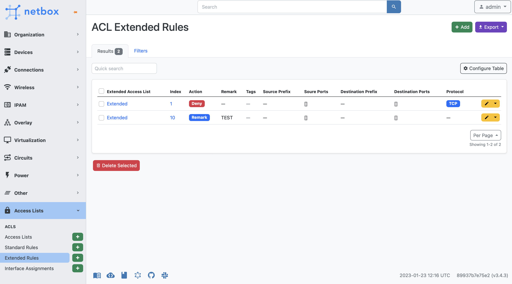

# NetBox Access Lists Plugin

A [Netbox](https://github.com/netbox-community/netbox) plugin for Access List management.

## Features

This plugin provides the following models:

- Access Lists
- Access List to Interface Assignment
- Access List Rules (abstract model bassis for other rules)
- Access List Standard Rules
- Access List Extended Rules

## Origin

Based on the NetBox plugin tutorial by [jeremystretch](https://github.com/jeremystretch):

- [demo repository](https://github.com/netbox-community/netbox-plugin-demo)
- [tutorial](https://github.com/netbox-community/netbox-plugin-tutorial)

All credit should go to Jeremy. Thanks, Jeremy!

This project just looks to build on top of this framework and model presented.

## Contributing

This project is currently maintained jointly by:

- [Abhimanyu Saharan](https://github.com/abhi1693)
- [Ryan Merolle](https://github.com/ryanmerolle)

See the [CONTRIBUTING](CONTRIBUTING.md) for more information.

## Compatibility

Each Plugin Version listed below has been tested with its corresponding NetBox Version.

| NetBox Version | Plugin Version |
|:--------------:|:--------------:|
|      3.6       |     1.4.0      |
|      3.5       |     1.3.0      |
|      3.4       |     1.2.2      |
|      3.3       |     1.1.0      |
|      3.2       |     1.0.1      |

## Installing

For adding to a NetBox Docker setup see
[the general instructions for using netbox-docker with plugins](https://github.com/netbox-community/netbox-docker/wiki/Using-Netbox-Plugins).

You can install with pip:

```bash
pip install netbox-acls
```

or by adding to your `local_requirements.txt` or `plugin_requirements.txt` (netbox-docker):

```bash
netbox-acls
```

## Configuration

Enable the plugin in `/opt/netbox/netbox/netbox/configuration.py`,
 or if you use netbox-docker, your `/configuration/plugins.py` file :

```python
PLUGINS = [
    "netbox_acls"
]

PLUGINS_CONFIG = {
    "netbox_acls": {
        "top_level_menu": True # If set to True the plugin will add a top level menu item for the plugin. If set to False the plugin will add a menu item under the Plugins menu item.  Default is set to True.
    },
}
```

## Developing

### VSCode + Docker + Dev Containers

To develop this plugin further one can use the included .devcontainer configuration. This configuration creates a docker container which includes a fully working netbox installation. Currently it should work when using WSL 2. For this to work make sure you have Docker Desktop installed and the WSL 2 integrations activated.

1. In the WSL terminal, enter `code` to run Visual studio code.
2. Install the devcontainer extension "ms-vscode-remote.remote-containers"
3. Press Ctrl+Shift+P and use the "Dev Container: Clone Repository in Container Volume" function to clone this repository. This will take a while depending on your computer
4. If you'd like the netbox instance to be prepopulated with example data from [netbox-initializers](https://github.com/tobiasge/netbox-initializers) run `make  initializers`
5. Start the netbox instance using `make all`

Your netbox instance will be served under 0.0.0.0:8000, so it should now be available under localhost:8000.

## Screenshots

Access List - List View


Access List (Type Extended) - Individual View


Access List (Type Standard) - Individual View


Extended Access List Rules - List View


Standard Access List Rules - List View


Access List Interface Assignments- List View


Host (device, virtual_chassis, virtual_machine) Access Lists - New Card


Host Interface (vminterface interface) Access Lists - New Card

